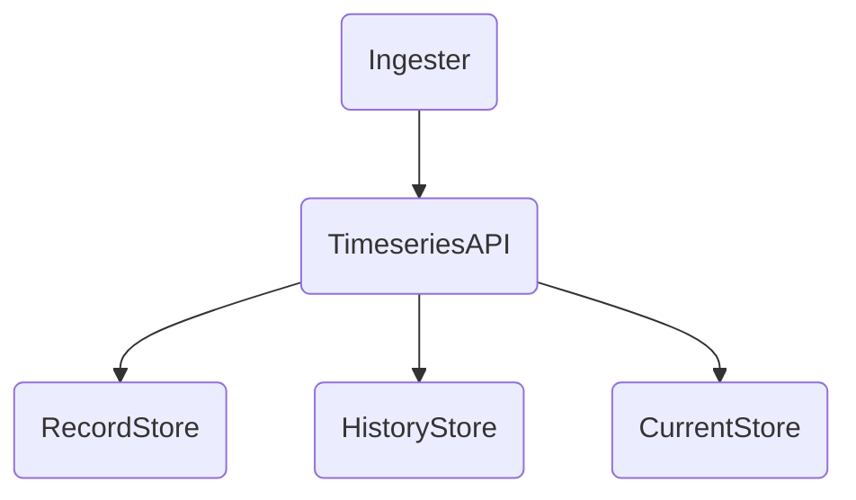

# Architecture

## TimeseriesAPI
This HTTP API service exposes endpoints for managing these types of data:

- Records
- Historical values
- Current values

## RecordStore
Stores point entity data. Different drivers may be provided for different storage backends.

Design goals:
1. Records are stored persistently
2. Querying by freeform tags is supported

## HistoryStore
Stores historical data. Different drivers may be provided for different storage backends.

Design goals:
1. Historical data is stored persistently over long time periods, where loss of data is unacceptable
2. Historical data frequency is relatively low compared to current data (e.g. no faster than once per minute)
3. Querying of historical data is efficient

## CurrentStore
Stores current data. Different drivers may be provided for different storage backends.

Design goals:
1. Current data storage is allowed to be volatile, where loss of data is acceptable
2. Current data frequency is relatively high compared to historical data (e.g. often faster than once per minute)

## Ingesters
Ingesters are responsible for delivering data from external sources and setting current values in the system. They are implemented for specific data sources, such as MQTT, etc.

Design goals:
1. Ingesters may set current values or historical values
2. They should be implemented externally to the core system, including details like scheduling, scalability, etc.